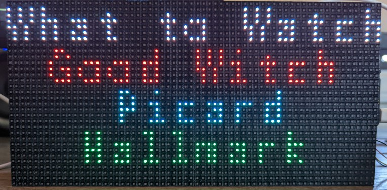

# Easy Remote with LED Display

## The Need
As my mom gets older, she is having trouble working the remote for her Roku devices.

I searched for a senior-friendly remote that worked with Roku but was unable to find one that didn't have way too many tiny buttons on it.

## The Solution
Build a 4-button remote with a large display.

Color code the buttons, LED lights on the keyboard, and text on the display.

This project is tailored to her watching habits, however, it can be easily modified.

In addition to the keypad this implementation will:
- Interact with the TV streaming Netflix every hour to avoid the "Are you still watching message"
- Turn on the bedroom TV automatically
- Turn both televisions off automatically

## How it works
The project is coded in [CircuitPython](https://circuitpython.org/).

You will need to create your own secrets file based on the example file included in the project. Documentation for building a secrets file can be found [here](https://learn.adafruit.com/electronic-history-of-the-day-with-pyportal/code-walkthrough-secrets-py).

To better understand how to interact with the Roku devices, please visit the [Roku Developers : External Control Protocol (ECP) documentation](https://developer.roku.com/en-ca/docs/developer-program/debugging/external-control-api.md)

Device information, channels, and shows are stored in the data.py file in the project.
- device_urls : One or more Roku devices available on the network
- shows : The shows/channels the person using this remote likes to watch
- channels :  The Roku channel names
- channel_numbers : The corresponding Roku channel IDs - see the ECP for how to get a channel ID
- frndly_guide_position : Unfortunately, Frndly TV app currently doesn't support the Roku search controls. For now you have to find your channel in the guide and count how many down from the top it is and us it for this value.
- netflix_search_int : Netflix doesn't put you back to the starting position on the search grid, so you have to note how many moves right it is from the last letter in your search to the program you want to select.

### Why I chose to use a data.py file?
I wanted the code to be flexible with as little hardcoding as possible. It's much easier to edit the data file then to make changes directly in the code.

## The hardware
All the hardware is from [Adafruit](https://www.adafruit.com).

- [Adafruit Matrix Portal Starter Kit - ADABOX 016 Essentials](https://www.adafruit.com/product/4812)
  - You can also get all the parts separately:
    - [Adafruit Matrix Portal](https://www.adafruit.com/product/4745)
	 - [64 x 32 RGB Matrix](https://www.adafruit.com/product/2278)
	 - [LED Diffusion Acrylic](https://www.adafruit.com/product/4749)
	 - [Adhesive Squares](https://www.adafruit.com/product/4813)
	 - [5V 2.4A Power Supply](https://www.adafruit.com/product/1995) + [USB C adapter](https://www.adafruit.com/product/4299)
- [NeoKey 1x4 QT I2C - Four Mechanical Key Switches with NeoPixels - STEMMA QT / Qwiic](https://www.adafruit.com/product/4980)
- [Kailh Mechanical Key Switches - Clicky White - 10 pack - Cherry MX White Compatible](https://www.adafruit.com/product/4955)

## 3D printing
The stand is designed in OpenSCAD and the source and STL files are included in the project. For my printer I had to break the stand into two halves. In order to do this there is a mortise/tenon joint to join the halves. If your printer is big enough you can print the whole unit at once. STL files are provided for each half, the entire stand, and the keyboard cover.

No matter how you print it you will need to print the offsets, screws, and keyboard cover separately.

I have not included supports in the STL files. You will need to add supports into your slicer or the print will not come out as intended.

- Nozzle: 0.3mm
- Nozzle Temperature: 210c
- Filament:
   - PLA for the stand
      - Color: Color change purple to blue
   - PETG for the keyboard cover
      - Color: Transparent
- Supports: Tree

- Mortise/Tenon Joint library provided by HopefulLlama
  - [Github project](https://github.com/HopefulLlama/JointSCAD)
  - [Thingiverse](https://www.thingiverse.com/groups/openscad/forums/general/topic:14842)
- Threads library provided by rcoyler
  - [Github project](https://github.com/rcolyer/threads-scad)
- The keycap STL file provided by Adafruit
  - [Custom Bluetooth Cherry MX Gamepad](https://learn.adafruit.com/custom-wireless-bluetooth-cherry-mx-gamepad/3d-printing)
  - [Thingiverse](https://www.thingiverse.com/thing:1989243)
